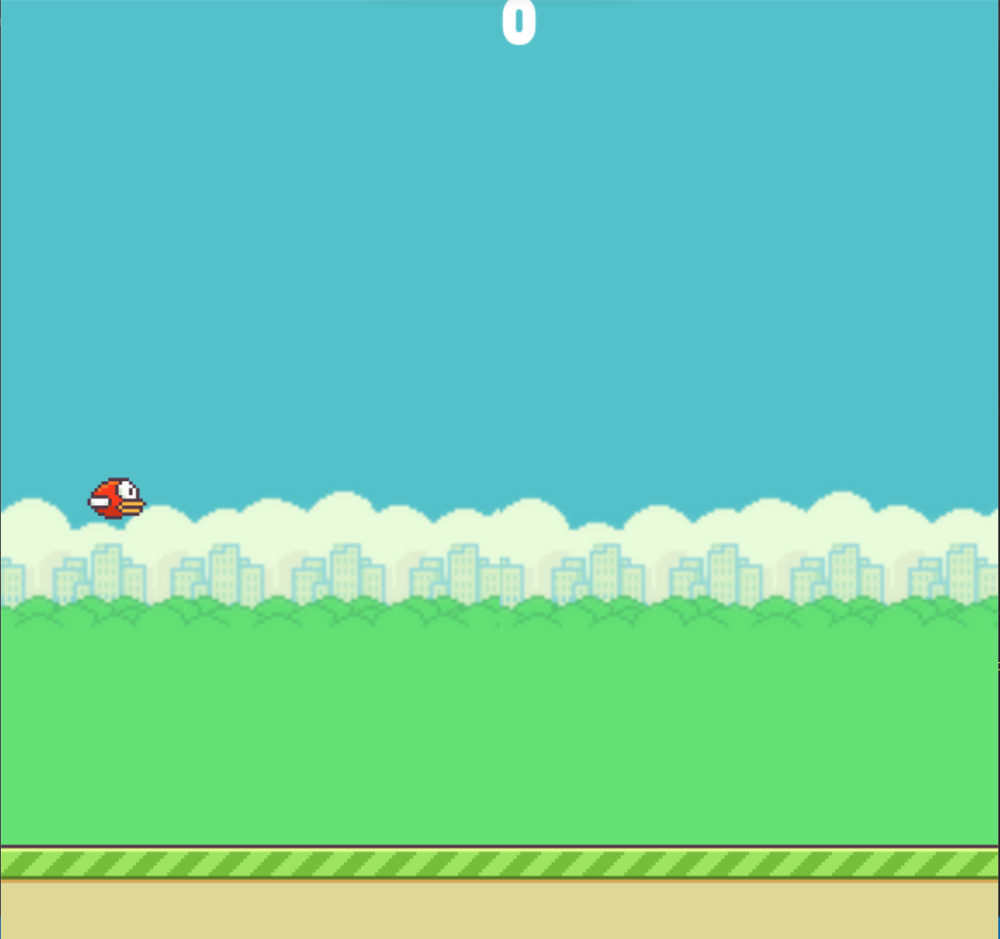

# Flappy Bird Game
This is a simple implementation of the classic Flappy Bird game using the Pygame library in Python. The game features a bird that the player can control to navigate through pipes by clicking the mouse.



## Requirements
Python 3.x
Pygame library

## Installation
- Install the required dependencies:
```cmd
pip install pygame
```

- Run the game:
```cmd
python main.py
```

## How to Play
- Click the mouse to make the bird jump.
- Navigate the bird through the pipes without hitting them.
- Each successful passage through the pipes earns one point.
- The game ends if the bird collides with a pipe or the ground.

## Game Features
- Responsive bird control through mouse clicks.
- Randomly generated pipes to add variability to the gameplay.
- Score tracking.
- Game over screen with a restart button.

## File Structure
- main.py: The main script containing the game implementation.
- img/: Directory containing the game images (background, bird, ground, pipes, and restart button).
- README.md: Documentation file you are currently reading.

## Customization
Feel free to customize the game by modifying the following:

- Images: Replace the images in the img/ directory with your own images.
- Game Variables: Adjust variables like scroll_speed, pipe_gap, and pipe_frequency in the script to change the game dynamics.
- Font and Colors: Modify the font type and color used in the game by updating the font and white variables.

## Credits
- https://www.youtube.com/playlist?list=PLjcN1EyupaQkz5Olxzwvo1OzDNaNLGWoJ
- This game was created using the Pygame library.
- Images used in the game are credited to their respective authors.